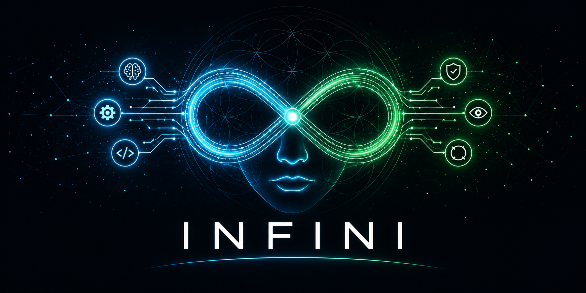

<div align="center">

<!-- ═══════════════════════════════════════════════════════════════════ -->
<!--                         JUNE 2026 PROFILE                          -->
<!-- ═══════════════════════════════════════════════════════════════════ -->

<picture>
  <source media="(prefers-color-scheme: dark)" srcset="assets/infini-hero.png">
  <source media="(prefers-color-scheme: light)" srcset="assets/infini-hero.png">
  
</picture>

<br/>


# Nick Ai

### Builder of portable agent infrastructure, governed AI systems, and open-source loops.

<a href="https://github.com/NickAiNYC/infini">
  
</a>

<br/><br/>

<p>
  <a href="https://github.com/NickAiNYC/infini"></a>
  &nbsp;
  
  &nbsp;
  
  &nbsp;
  
</p>

<br/>

[**INFINI**](https://github.com/NickAiNYC/infini) · [Scrutexity](https://scrutexity.com) · [X](https://x.com/nickaltstein) · [LinkedIn](https://linkedin.com/in/nicklatstein)

</div>

---

## Current Focus: INFINI

> **Agents need their Docker moment.**
>
> INFINI is an open standard for agent portability: define autonomous work as a portable Loopfile, execute it through different runtimes, verify the result, and replay the trace when something breaks.

<table>
  <tr>
    <td width="50%" valign="top">
      <h3>Why it matters</h3>
      <p>Most agent logic is trapped inside frameworks, SDKs, prompts, and brittle orchestration code. INFINI moves the logic into a declarative spec so the same workflow can travel across engines.</p>
      <ul>
        <li><strong>Portable logic</strong> — one Loopfile, multiple runtimes.</li>
        <li><strong>Inspectable execution</strong> — standardized traces instead of black-box logs.</li>
        <li><strong>Replayable runs</strong> — debug the loop, not just the error.</li>
        <li><strong>Adapter ecosystem</strong> — Hermes, OpenClaw, and future community runtimes.</li>
      </ul>
    </td>
    <td width="50%" valign="top">
      <h3>Quickstart</h3>

```bash
pip install infini-cli
infini validate loop.yaml
infini run examples/golden-research-assistant/research-loop.yaml --mock
infini ui runs/latest/run.json
```

<sub>Validate the spec. Run the loop. Inspect the trace. Replay the system.</sub>
    </td>
  </tr>
</table>

<div align="center">

<a href="https://github.com/NickAiNYC/infini">
  
</a>

<br/>

<a href="https://github.com/NickAiNYC/infini"></a>
&nbsp;
<a href="https://github.com/NickAiNYC/infini"></a>
&nbsp;
<a href="https://github.com/NickAiNYC/infini/blob/main/spec/loopfile-v1.md"></a>
&nbsp;
<a href="https://github.com/NickAiNYC/infini/tree/main/registry/certifications"></a>

</div>

---

## The Loopfile Idea

```yaml
LOOPFILE: "1.0"
name: research-assistant

AGENTS:
  - { name: researcher, model_tier: sonnet, tools: [browser] }
  - { name: verifier,  model_tier: haiku }

STEPS:
  - { id: s1, action: browser.find_sources, uses: researcher }
  - { id: s2, action: verify_citations, uses: verifier, depends_on: [s1] }

VERIFY:
  syntactic: ["every_claim_has_citation"]
  semantic: ["source_quality >= 85"]
  confidence_threshold: 85

BUDGET: { dollars: 6, minutes: 20 }
STOP_WHEN: ["all_verify_passed"]
```

<div align="center">

```text
Loopfile → Engine → Adapter → Execution → Trace → Replay → Observatory
```

</div>

---

## What I Build

<table>
  <tr>
    <td width="33%" valign="top">
      <h3>Open Standards</h3>
      <p>Specs, schemas, conformance tests, adapters, certification paths, and contributor-friendly docs.</p>
    </td>
    <td width="33%" valign="top">
      <h3>Governed Agents</h3>
      <p>Agent loops with verification, policy boundaries, audit trails, replay, budget controls, and escalation logic.</p>
    </td>
    <td width="33%" valign="top">
      <h3>Trust Infrastructure</h3>
      <p>Claim intelligence, visibility systems, proof assets, and AI workflows for regulated or trust-sensitive markets.</p>
    </td>
  </tr>
</table>

---

## Featured Systems

| Project | What it is | Why it exists |
| --- | --- | --- |
| **[INFINI](https://github.com/NickAiNYC/infini)** | Open standard for portable, inspectable agent loops. | To make autonomous work reusable across frameworks. |
| **[Scrutexity](https://scrutexity.com)** | Governed growth infrastructure for claim-sensitive businesses. | To help teams prove claims, improve visibility, and recover demand safely. |
| **AuditGPT / Claim Intelligence** | Claim review and proof-gap detection layer. | To turn risky public claims into safer, evidence-backed assets. |
| **Contento by Scrutexity** | Governed content workflow. | To produce content from approved claims instead of unsupported marketing guesses. |

---

## Engineering Principles

```text
Spec first. Demo second. Hype last.
Readable artifacts beat magic.
Every loop needs a verifier.
Every verifier needs a trace.
Every trace should be replayable.
```

I care about systems that are understandable under pressure: when a demo fails, when an agent drifts, when a customer asks why, when a regulator asks for proof, or when a contributor wants to extend the standard.

---

## Stack

<div align="center">


<br/><br/>


</div>

---

## GitHub Signals

<div align="center">


&nbsp;


<br/><br/>


</div>

---

## Contribution Feed

<div align="center">

<picture>
  <source media="(prefers-color-scheme: dark)" srcset="https://raw.githubusercontent.com/NickAiNYC/NickAiNYC/output/github-contribution-grid-snake-dark.svg" />
  <source media="(prefers-color-scheme: light)" srcset="https://raw.githubusercontent.com/NickAiNYC/NickAiNYC/output/github-contribution-grid-snake.svg" />
  
</picture>

</div>

---

## Now Building

- **INFINI reference runtime** — end-to-end Loopfile execution, trace generation, replay, and Observatory.
- **Adapter certification** — conformance tests for Hermes, OpenClaw, and community frameworks.
- **Loop registry** — a contribution layer for reusable loops, skills, patterns, and benchmark cases.
- **Governed growth systems** — Scrutexity, AuditGPT, Contento, AI visibility, and recovery workflows.

---

<div align="center">

### Building the standard layer for autonomous work.

<p>
  <a href="https://github.com/NickAiNYC/infini"></a>
  &nbsp;
  <a href="https://scrutexity.com"></a>
  &nbsp;
  <a href="https://x.com/nickaltstein"></a>
  &nbsp;
  <a href="https://linkedin.com/in/nicklatstein"></a>
</p>

<br/>


<br/><br/>


</div>
